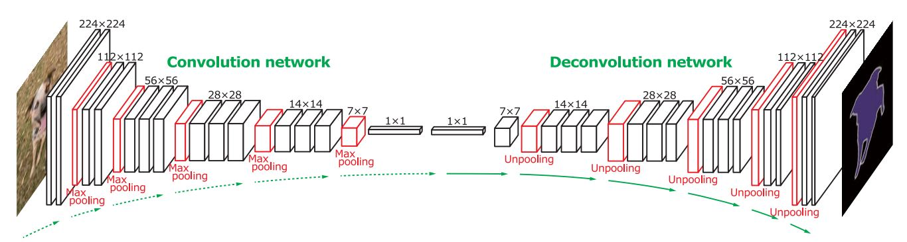
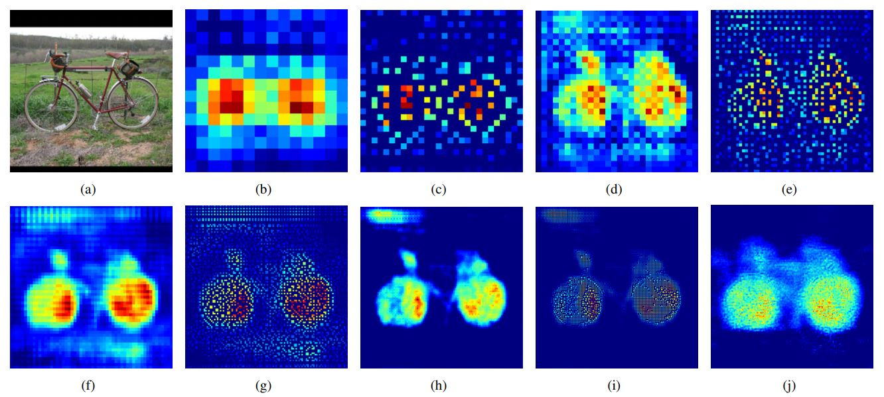
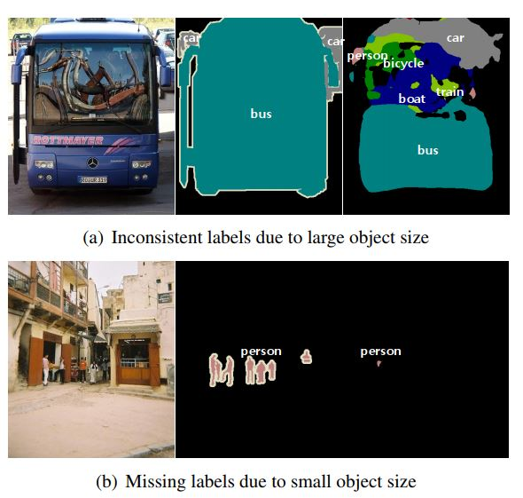
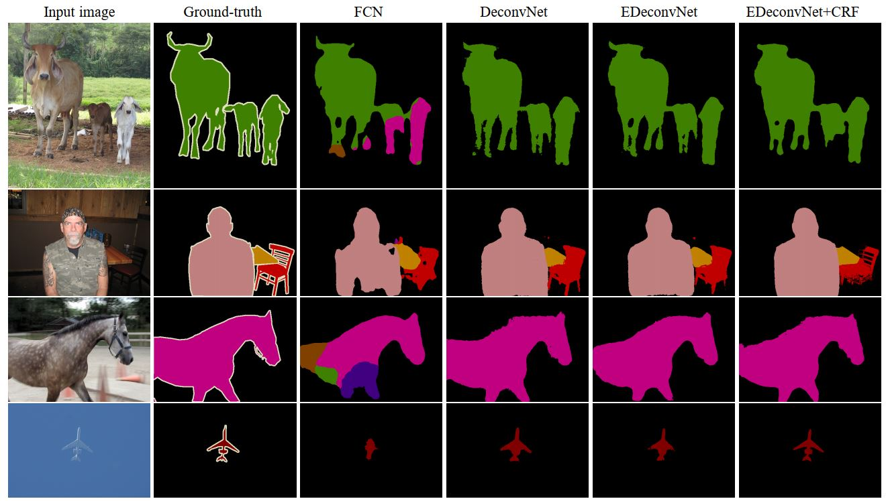

# Note-for-DeconvNet
make notes for DeconvNet

论文名称：Learning Deconvolution Network for Semantic Segmentation

论文地址：[https://arxiv.org/abs/1505.04366](https://arxiv.org/abs/1505.04366)

代码地址：[https://github.com/fabianbormann/Tensorflow-DeconvNet-Segmentation](https://github.com/fabianbormann/Tensorflow-DeconvNet-Segmentation)

这篇论文是收录在ICCV 2015的一篇关于语义分割的论文。论文提出深度反卷积网络，在VGG16的顶部添加反卷积网络。反卷积网络由deconvolution, unpooling和relu组成。具体来说，在VGG16网络提取特征的过程中，对于每一个池化操作，记住每个激活值在窗口中的位置，然后unpooling操作其实就是按照位置来还原出池化前的特征图，至于窗口中的其他位置，则按最简单的补零来处理。但是这样一来的话，进过unpooling layer还原出来的feature map就很sparse, 因为有很多0，于是在unpooling层后面又加了一个deconvolution layer，用来生成更密集的feature map。而反卷积网络就是靠着反池化和反卷积操作交错搭建起来的，跟VGG16形成镜像结构，具体见下图：

作者还对反卷积网络里的每一层做了可视化分析。总体上来说，unpooling layer通过记住池化操作时原始激活值的位置，因而能还原出更多的位置和分辨率信息，自然也可以更好的重建图像的结构细节；而deconvolution layer可以捕捉特定类的形状，具体来说，与类相关（如自行车）的激活值将被放大，而其他区域的噪声激活值将被抑制。通过这两个层的结合，可以得到更好的分割结果。

另外，和传统的语义分割不一样，DeconvNet并不是把整幅图像输入网络，而是用edge-box选出很多proposal，对每一个proposal进行分割，然后再按照pixel-wise maximum来合并。这样做主要是为了克服FCN固定感受野的缺陷，那些大于或者小于感受野的目标，就可能被分裂或者错误标记。具体来说，对于大目标，进行预测时只使用了local infomation所以会导致属于同一个目标的像素被误判为不连续的标签，即不同的目标；而对于小目标来说，经常被忽略掉，被当做了背景，如下图所示：

而通过这种结合目标检测的instance-wise prediction，一可以解决分割时的多尺度问题，而也可以减少由于搜索空间而带来的训练复杂度。FCN的另一个缺陷就是，一个物体的具体结构细节会随着卷积操作而丢失，FCN简单的用bilinear interpolation并不能从本质上来解决这个问题，这也是本篇论文DeconvNet做出的主要贡献，通过unpooling和学习到的deconvolution filter来重建结构细节。

作者还尝试了把FCN的结果和DeconvNet的结果进行简单的合并，发现比之前效果要好。最后还用CRF来做后处理，虽然数值指标上提升不大（1%），不过视觉效果上还是有一定改善。以下是一些实验的对比结果。

